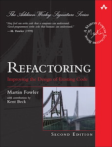
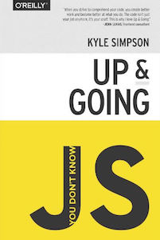
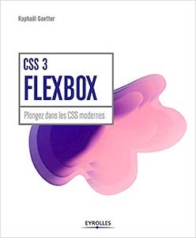
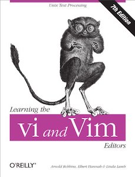
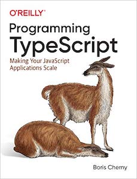
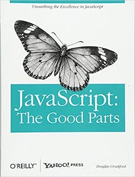
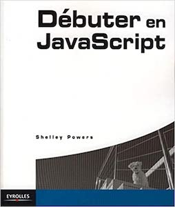

# Books

## Why books?

Some goes deep.

Some teach very well, taking time, sharing a lot more that only the necessary.

Some share humbly their vision and the culture of the tech industry.

Bottom line: willing to become a great developer often leads us to books. 📚 

## Reading now...

    
    

## Next...

    
    
    
    
    
    
    
    
    

## Rood them and recommend them here!

    
    
    
    
    
    
    
    
    
    
    

## Rood them and meh 😕

They can be boring, they may not go deep enough, I may have read a better book on that subject or it may be only me.

    
    
    
    

