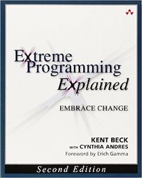
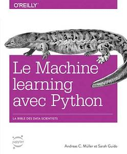
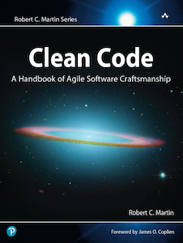

# Books

## Reading now...

    
    

## Next...

    
    
    
    
    
    

## Rood them and talk about them here!

    
    
    
    
    
    
    
    
    
    
    
    
    
    

## Rood them and didn't like them

They can be boring, they may not go deep enough, or it may be only me.

The fact is I don't see the point to talk about these books, nor recommend them.

    

